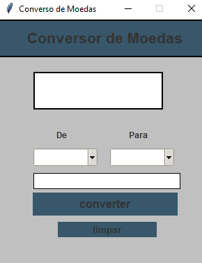
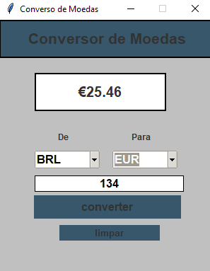

<<<<<<< HEAD
# Conversor de Moedas
=======
# conversor_de_moeda

>>>>>>> ab4c69e1c8a6374086e85fa0fa59df4ac901b1c5
## Sobre o Projeto 

Conversor de  Moedas construido durante o segundo modulo Bootcamo mastertech-IBMM.
O aplicação consite em pegar uma moeda exemplo(Dolar), e converter para moeda(REAL), apresenta uma interface grafica para melhor visualização.

# 🚀 Começando
Criamos um conversor de moedas em python. Aqui usamos o Tkinter para a GUI e a biblioteca request para fazer a chamada da API.
A ide escolhida foi o vscode, criamos o layout do projeto, criamos as funções, buttons, label e frames  e concluimos todo o processo para a conversão das moedas.

<<<<<<< HEAD

    

# ⚙️ Executando os testes!
 
 Testes realizados no terminal do vscode todos foram positivos, aplicação funcionand

 <video src="../../Desktop/Conversor%20de%20Moedas%20.mp4" controls title="testando o cód"></video>

# 🛠️ Construído com!
=======

# ⚙️ Executando os testes
 
 Testes realizados no terminal do vscode todos foram positivos, aplicação funcionando

# 🛠️ Construído com
>>>>>>> ab4c69e1c8a6374086e85fa0fa59df4ac901b1c5
https://code.visualstudio.com/download: IDE usado

https://api.exchangerate-api.com/v4/latest/: requisição de API

# BiBLIOTECAS USADAS

<<<<<<< HEAD
from audioop import getsample 
 
from tkinter import Tk, ttk

from tkinter import *

import requests

import json

=======
 from audioop import getsample
 
from tkinter import Tk, ttk
from tkinter import *
import requests
import json
>>>>>>> ab4c69e1c8a6374086e85fa0fa59df4ac901b1c5
import string

# ✒️ Autores
Desenvolvedores - Trabalho Inicial -(https://github.com/Luciane-Weber) (https://github.com/danubiabuba) (https://github.com/Suzirss)
# 🎁 Expressões de gratidão
** Agradeço a todos pelo comprometimento e garra para desnvolvimento deste projeto. sem voçes não seria possivel entregar esse trabalho.

<<<<<<< HEAD
⌨️ com ❤️ por Danubia Alves 😊
=======
⌨️ com ❤️ por Danubia Alves 😊
>>>>>>> ab4c69e1c8a6374086e85fa0fa59df4ac901b1c5
